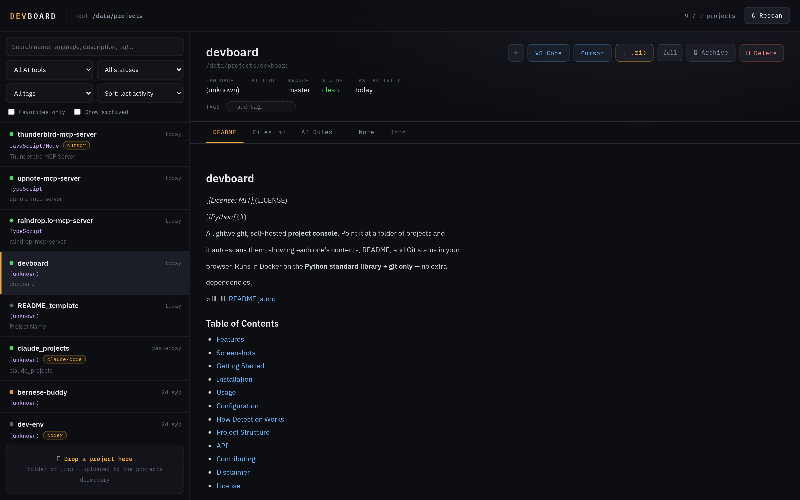

# devboard

[](LICENSE)
[](#)

軽量・セルフホスト型の**プロジェクトコンソール**。プロジェクトを置いたフォルダを
指定すると自動でスキャンし、各プロジェクトの内容・README・Git の状態をブラウザから
一覧/閲覧できます。**Python 標準ライブラリ + git のみ**で Docker 上で動作し、追加の
依存パッケージはありません。

> English: [README.md](README.md)

## 目次

- [特徴](#特徴)
- [スクリーンショット](#スクリーンショット)
- [はじめに](#はじめに)
- [インストール](#インストール)
- [使い方](#使い方)
- [設定](#設定)
- [検出の仕組み](#検出の仕組み)
- [プロジェクト構成](#プロジェクト構成)
- [API](#api)
- [コントリビュート](#コントリビュート)
- [免責事項](#免責事項)
- [ライセンス](#ライセンス)

## 特徴

- 指定フォルダ以下を再帰スキャンして**プロジェクトを自動検出**
  - コードマーカー: `.git` / `package.json` / `pyproject.toml` / `Cargo.toml` / `go.mod` / `Makefile` ほか
  - ドキュメントマーカー（コード無しでも検出）: `README*` / `CLAUDE.md` / `AGENTS.md` / `GEMINI.md` / `.cursorrules` / copilot-instructions
- 言語と **AI ツールの推定**（Claude Code, Codex, Cursor, Copilot, Gemini, Aider, Continue）
- **Git の状態**: ブランチ・未コミット変更・ahead/behind・最終コミット・リモート
- 最終アクティビティ（git 最終コミットまたはフォルダ更新時刻）でソート
- README のレンダリング表示と**開閉できるファイルツリー**（フォルダをクリックすると中身をその場で展開/折りたたみ。3 階層までネスト表示し、それより深い階層は印を付けて表示）
- **AI ルールファイルの閲覧**（`CLAUDE.md` / `.cursorrules` / `AGENTS.md` / `GEMINI.md` / copilot-instructions / `.aider.conf.yml`）
- プロジェクトごとの**タグ・お気に入り**（`<project>/.devboard/tags.json`）と**メモ**（`<project>/.devboard/note.md`）
- **ドラッグ＆ドロップ**でフォルダ / `.zip` アップロード（macOS の `__MACOSX/`・`.DS_Store`・`._*` は自動除去）
- アーカイブ（`./projects/.archive/`）と削除（`./projects/.trash/` へ退避、完全消去はしない）
- **「VS Code / Cursor で開く」**ボタン（Remote-SSH URL）
- 名前・言語・AI ツール・タグ・状態での検索／フィルタ
- HTTP JSON API

## スクリーンショット



起動後、<http://localhost:8080> を開きます。

## はじめに

### 前提条件

- Docker および Docker Compose
- `git` はイメージに同梱（ホストへのインストール不要）

## インストール

```bash
git clone https://github.com/your-username/devboard.git
cd devboard
docker compose up -d --build
```

起動後、<http://localhost:8080> を開きます。

## 使い方

- ページにフォルダや `.zip` をドラッグ＆ドロップ、**または**ホストの `./projects/` に
  プロジェクトフォルダを直接配置します。
- 一覧は `CACHE_TTL` 秒ごと（既定 30 秒）に自動再スキャンされます。

## 設定

`docker-compose.yml` の環境変数で設定します。

| 変数 | 既定 | 説明 |
|---|---|---|
| `PROJECTS_DIR` | `/data/projects` | コンテナ内のスキャン対象 |
| `PORT` | `8080` | 待ち受けポート |
| `SCAN_DEPTH` | `4` | プロジェクト探索の再帰深さ |
| `CACHE_TTL` | `30` | 一覧の自動再スキャン秒数 |
| `MAX_UPLOAD_MB` | `500` | アップロード 1 件あたりの最大サイズ |
| `IDE_REMOTE_HOST` | （空） | 例: `user@your-host`。「IDE で開く」ボタンを有効化 |
| `IDE_HOST_PROJECTS` | （空） | ホスト側 projects ディレクトリの絶対パス（IDE URL 生成用） |

`user: "1000:1000"` は自分の `id -u`:`id -g` に合わせると、アップロードしたファイルが
root 所有になりません。API キーやアクセストークンなどの秘密情報はコミットしないでください。

## 検出の仕組み

フォルダにコードマーカーまたはドキュメントマーカー（[特徴](#特徴)参照）の**いずれか**が
あれば、プロジェクトルートとして扱います。プロジェクトルートを見つけたらその配下へは
降りないため、ネストしたファイルが二重に登録されることはありません。ビルド/依存ディレクトリ
（`.git`・`node_modules`・`.venv`・`dist`・`build` …）はスキップされます。

## プロジェクト構成

```text
.
├── server.py          # HTTP サーバー + JSON API
├── scanner.py         # プロジェクト検出・解析
├── index.html         # シングルページ UI
├── Dockerfile
├── docker-compose.yml
├── projects/          # ここにプロジェクトを置く（スキャン対象 / git 管理外）
├── README.md          # 英語版 README
└── README.ja.md       # 日本語版 README
```

## API

```bash
# プロジェクト一覧
curl -s http://localhost:8080/api/projects

# プロジェクト詳細
curl -s 'http://localhost:8080/api/project?path=/data/projects/<name>'

# タグ追加 / お気に入り
curl -s -X POST 'http://localhost:8080/api/tags?path=/data/projects/<name>' \
  -d '{"tags":["wip","experimental"],"favorite":true}'
```

## コントリビュート

コントリビューションを歓迎します。

1. リポジトリをフォークします。
2. 機能ブランチを作成します: `git checkout -b feature/your-feature`
3. 変更をコミットします: `git commit -m "Add your feature"`
4. ブランチにプッシュします: `git push origin feature/your-feature`
5. プルリクエストを作成します。

## 免責事項

本ソフトウェアは「現状のまま」提供され、いかなる保証もありません（[LICENSE](LICENSE) 参照）。本ツールはプロジェクトのアップロード・アーカイブ・削除（削除は `./projects/.trash` へ退避）を行います。**利用は自己責任**でお願いします。特に破壊的な操作は内容を確認し、バックアップを取った上でご利用ください。作者はデータ損失・損害について一切の責任を負いません。

## ライセンス

このプロジェクトは MIT License のもとで公開されています。詳細は [LICENSE](LICENSE) を参照してください。

## 謝辞

- Python 標準ライブラリと `git` のみで構築（サードパーティの実行時依存なし）。
